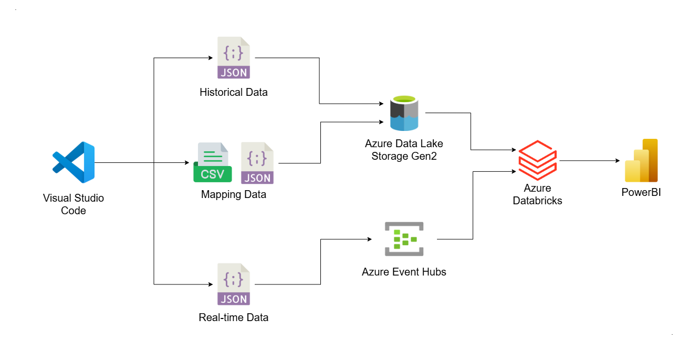
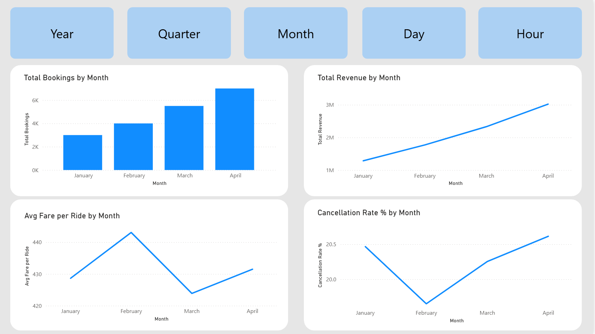
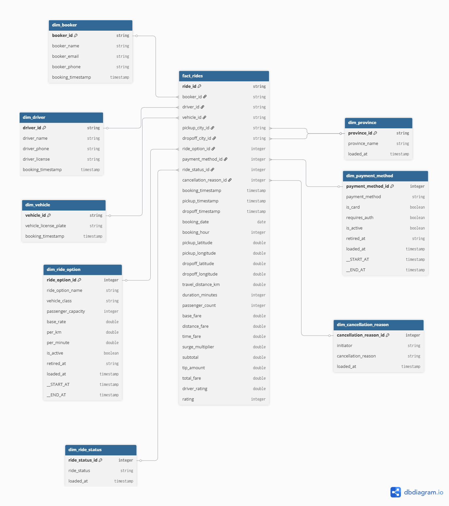

# 🚕 End-to-End Ride-Hailing Data Pipeline

## 🏗️ Architecture



---

## 💡 Why I Built This

I have been interested in data engineering for some time. In my previous work, I often extracted, validated, cleaned, and loaded data manually, repeating the same process whenever new data became available.While this approach was effective for smaller workloads, it was time-consuming, difficult to maintain, and not easily scalable. 

To better understand how modern data platforms automate these processes, I wanted to gain hands-on experience with the tools, architectures, and workflows used in production environments. As a result, I built this project to design and implement an end-to-end data pipeline that moves raw data through ingestion, transformation, and visualization, delivering insights through an interactive dashboard.

---

## 📋 Table of Contents

- [Architecture](#-architecture)
- [Dashboard](#-dashboard)
- [Data Generator](#-data-generator)
- [Data Pipeline](#-data-pipeline--bronze--silver--gold)
- [Data Structure](#-data-structure)
- [Project Structure](#-project-structure)
- [Skills Demonstrated](#-skills-demonstrated)
- [Setup](#-setup)
- [References](#-references)

---

Three data flows feed into the pipeline:

| Flow | Description |
|---|---|
| **Historical batch** | CSV/JSON files uploaded to Azure Data Lake Storage Gen2 |
| **Mapping data** | Province, ride option, and payment method JSON files uploaded to ADLS |
| **Real-time stream** | Live ride records streamed to Azure Event Hub |

All three flows converge in **Azure Databricks** where data is processed through the Bronze → Silver → Gold medallion architecture before being served to **Power BI**.

---

## 📊 Dashboard



4-page interactive dashboard built on the Gold Layer star schema.

| Page | Business Question |
|---|---|
| 📈 **Growth** | Is the business heading in the right direction? |
| ❌ **Cancellation & Service Quality** | Why are rides failing and who is responsible? |
| 🗺️ **Geographic Performance** | Where should we invest or expand? |
| 💰 **Ride Option & Revenue** | Which products make money and which need attention? |


---

## ⚙️ Data Generator

The generator creates realistic ride records using **real Thai geographic coordinates** — not random lat/lon values. It uses a self-hosted **Nominatim** instance (OpenStreetMap) running in Docker to validate that every pickup and dropoff point is on land, inside Thailand, and within the correct province.

### How location generation works

```
1. Request bounding box for a province from Nominatim
         e.g. "Bangkok, Thailand" → lat/lon bounds

2. Sample a random coordinate within the bounding box

3. Reverse geocode the coordinate
         → Is it on land?
         → Is it inside Thailand?
         → Does the province match?

4. Pass → use this coordinate
   Fail → retry (up to 500 attempts)
```

### Simulation parameters

| Parameter | Value | Detail |
|---|---|---|
| Hot provinces | 11 | Bangkok, Phuket, Chiang Mai, Pattaya, etc. |
| Hot province selection chance | 80% | Simulates real urban demand concentration |
| Same-province dropoff chance | 70% | Most rides stay within one province |
| Completion rate | 80% | 20% of rides are cancelled |
| Surge hours | 7–9 AM, 5–8 PM | Multiplier 1.2x–1.5x |
| Tip chance | 20% | 5–20% of subtotal |
| Driver pool | 500 drivers | Reused across rides to simulate real drivers |
| Customer pool | 5,000 customers | Reused to simulate repeat users |

### Ride option distance suitability

| Ride Option | Short (0–5km) | Medium (5–15km) | Suburban (15–80km) | Regional (80–250km) | Cross-country |
|---|---|---|---|---|---|
| Economy | ✅ | ✅ | ✅ | ❌ | ❌ |
| Taxi | ✅ | ✅ | ✅ | ❌ | ❌ |
| Bike | ✅ | ✅ | ❌ | ❌ | ❌ |
| Premium | ❌ | ✅ | ✅ | ✅ | ❌ |
| SUV | ❌ | ✅ | ✅ | ✅ | ✅ |
| Van | ❌ | ❌ | ✅ | ✅ | ✅ |

### Commands

```bash
# Print 5 records to terminal
python data_generator.py generate --count 5

# Generate historical batch and save to CSV
python data_generator.py historical --count 25000 --format csv --duration 2026-01-01:2026-02-01

# Stream live records to Azure Event Hub
python data_generator.py eventhub --mode stream --interval 0.5

# Upload files to Azure Data Lake Storage
python upload_historical.py --from-date 20260101 --to-date 20260601
```

---

## 🔄 Data Pipeline — Bronze → Silver → Gold

### 🥉 Bronze — Raw Ingestion

| Script | Source | Target | Description |
|---|---|---|---|
| `ingest_events.py` | Azure Event Hub | `bronze.eh_rides` | Real-time ride records via Kafka |
| `ingest_historical.py` | ADLS CSV/JSON | `bronze.historical_rides` | Batch rides with manifest-based deduplication |
| `ingest_mapping.py` | ADLS JSON | `bronze.map_*` | Provinces, ride options, payment methods |

### 🥈 Silver — Enrichment & Privacy

| Script | Source | Target | Transformations |
|---|---|---|---|
| `rides_enriched.py` | `bronze.eh_rides` + `bronze.historical_rides` | `silver.rides_enriched` | Cast timestamps · Hash PII with SHA-256 |

**PII fields hashed:** `booker_name`, `booker_email`, `booker_phone`, `driver_name`, `driver_phone`, `driver_license`, `vehicle_license_plate`

### 🥇 Gold — Star Schema



---

## 📐 Data Structure

**Dimension tables:**

| Table | SCD Type | Key Columns |
|---|---|---|
| `dim_booker` | Type 1 | booker_id |
| `dim_driver` | Type 1 | driver_id |
| `dim_vehicle` | Type 1 | vehicle_id |
| `dim_province` | Static | province_id, province_name |
| `dim_ride_status` | Static | ride_status_id, ride_status |
| `dim_cancellation_reason` | Static | cancellation_reason_id, initiator, cancellation_reason |
| `dim_ride_option` | Type 2 | ride_option_id, ride_option_name, base_rate, per_km, per_minute |
| `dim_payment_method` | Type 2 | payment_method_id, payment_method, is_card |

**Fact table:**

| Table | Grain | Key Measures |
|---|---|---|
| `fact_rides` | One row per ride | total_fare, travel_distance_km, duration_minutes, surge_multiplier, tip_amount, rating, driver_rating |

> **SCD Type 1** — always reflects the latest value, no history kept.
> **SCD Type 2** — keeps a full history of changes. Old rides always link to the correct version of the ride option or payment method at the time of booking.

---

## 🗂️ Project Structure

```
ride-hailing-project/
├── azure_databricks/              # Databricks pipeline notebooks
│   ├── pipeline-bronze/
│   │   ├── ingest_historical.py
│   │   ├── ingest_mapping.py
│   │   └── pipeline-bronze-ingestion/transformations/
│   │       └── ingest_events.py
│   ├── pipeline-silver/
│   │   └── pipeline-silver-enriched/transformations/
│   │       └── rides_enriched.py
│   └── pipeline-gold/
│       └── pipeline-gold-star-schema/transformations/
│           └── star_schema.py
├── generator/                     # Data generation logic
│   ├── core.py                    # Ride record simulation
│   ├── geocoding.py               # Nominatim location generator
│   ├── config.py                  # Probabilities and parameters
│   ├── pool.py                    # Driver and customer pools
│   ├── loader.py                  # Mapping data loader
│   └── modes/
│       ├── generate.py            # Terminal output mode
│       ├── historical.py          # File output mode
│       └── eventhub.py            # Azure Event Hub mode
├── settings/
│   └── storage.py                 # Paths and Azure settings
├── data/
│   ├── mapping_data/              # Province, ride option, payment method JSON
│   ├── historical_data/           # Generated CSV/JSON ride files
│   └── pools/                     # Driver and customer pool files
├── powerbi/
│   └── powerbi-dashboard.pbix    # Power BI dashboard
├── docs/
│   └── images/                   # Architecture and dashboard screenshots
├── data_generator.py              # CLI entry point
├── upload_historical.py           # Upload files to ADLS
├── generate_pools.py              # Pre-generate driver/customer pools
├── .env.example                   # Required environment variables
├── REFERENCES.md                  # External documentation
└── requirements.txt
```

---

## 🎯 Skills Demonstrated

| Skill | Detail |
|---|---|
| **Data Engineering** | End-to-end pipeline from raw ingestion to reporting |
| **Cloud (Azure)** | ADLS Gen2, Event Hub, Databricks, Unity Catalog |
| **Streaming** | Real-time ingestion via Azure Event Hub + Kafka |
| **Batch Processing** | Historical CSV/JSON ingestion with deduplication |
| **Delta Lake** | Bronze/Silver/Gold medallion architecture |
| **Delta Live Tables** | Declarative pipeline with CDC and SCD support |
| **Star Schema** | Dimensional modeling with SCD Type 1 and Type 2 |
| **PII Protection** | SHA-256 hashing of personal data in Silver layer |
| **Python** | Data generation, geocoding, Azure SDK, CLI tooling |
| **Power BI** | Multi-page dashboard with DAX measures and drill-through |
| **Geospatial** | Real coordinate generation using Nominatim + OpenStreetMap |

---

## 🚀 Setup

**1. Clone the repository**
```bash
git clone <repo-url>
cd ride-hailing-project
```

**2. Create virtual environment**
```bash
python -m venv .venv
.venv\Scripts\activate       # Windows
source .venv/bin/activate    # Mac / Linux
```

**3. Install dependencies**
```bash
pip install -r requirements.txt
```

**4. Set up environment variables**
```bash
cp .env.example .env
# Fill in your Azure credentials
```

**5. Start Nominatim Docker**
```bash
docker run -p 8080:8080 mediagis/nominatim
```

**6. Generate data**
```bash
python data_generator.py historical --count 5000 --format csv --duration 2026-01-01:2026-02-01
```

**7. Upload to Azure**
```bash
python upload_historical.py
```

---

## 📚 References

See [REFERENCES.md](REFERENCES.md) for all external documentation and resources used in this project.
